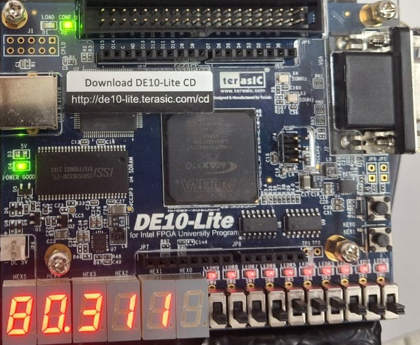
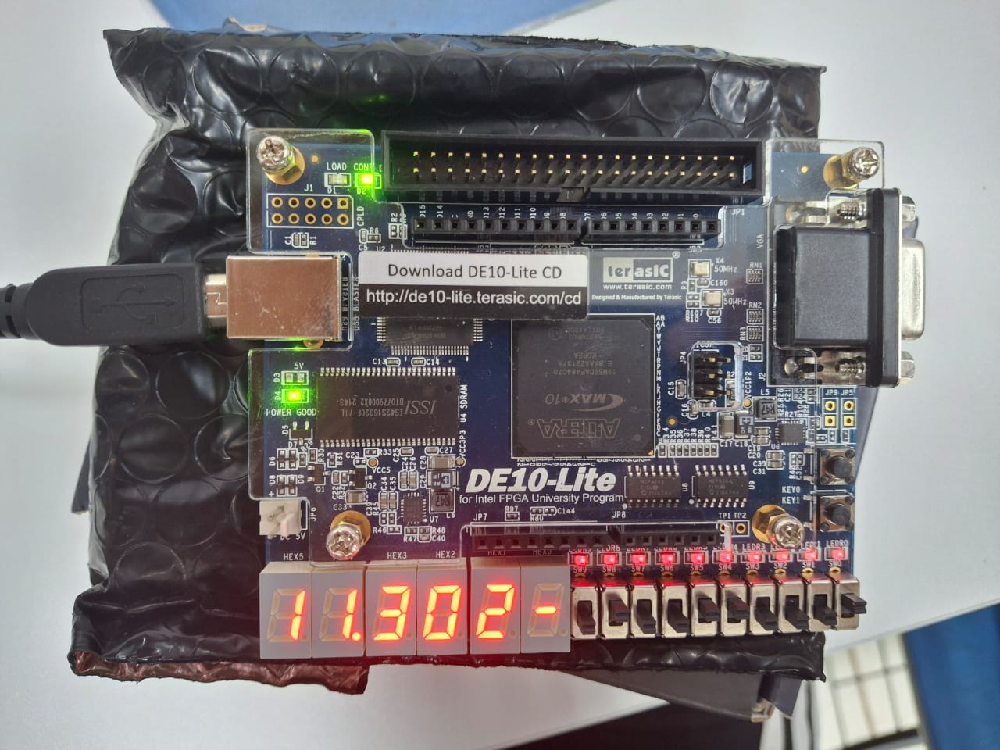
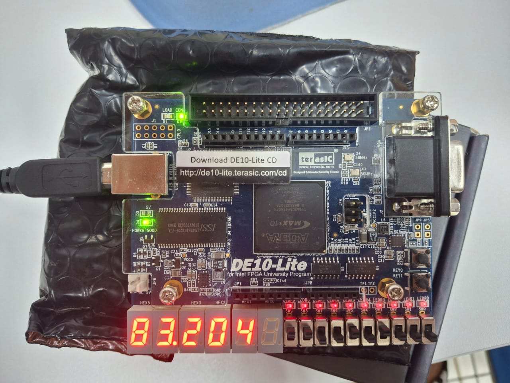
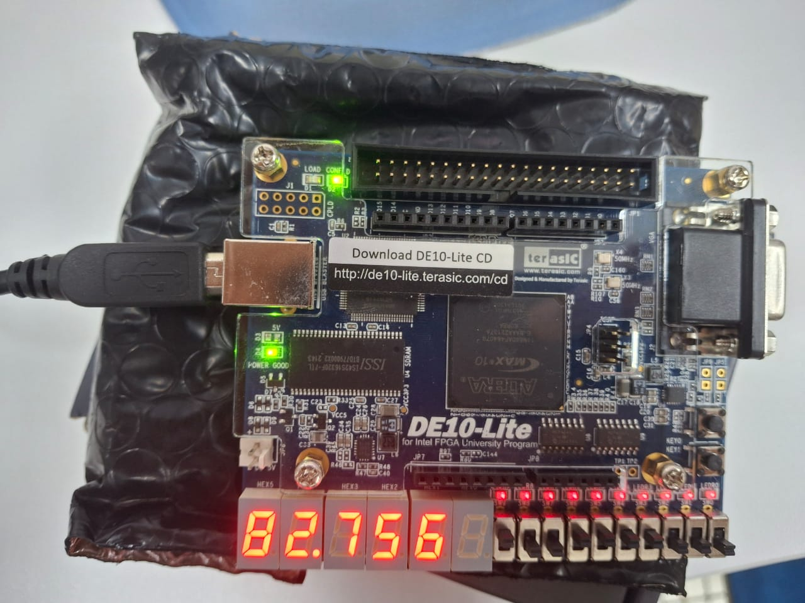

# Calculadora em VHDL com Display de 7 Segmentos

## Projeto da Disciplina de Lógica Reconfigurável

Este projeto foi desenvolvido para a disciplina de Lógica Reconfigurável e consiste na implementação de uma calculadora utilizando a linguagem de descrição de hardware (HDL) VHDL, com exibição dos resultados em um display de 7 segmentos.

---

## 📝 Descrição do Projeto

O objetivo principal foi criar uma calculadora funcional que permite ao usuário selecionar números e operações aritméticas básicas através de switches. A confirmação da operação é realizada por meio de um botão, e o resultado é subsequentemente exibido no display de 7 segmentos. Este projeto visa aplicar os conceitos de lógica reconfigurável na prática, desde a concepção do circuito até a sua implementação e teste em hardware.

---

##  Funcionalidades

* **Seleção de Operandos:** Números de entrada selecionados via switches.
* **Seleção de Operação:** Operações aritméticas (adição, subtração, multiplicação, divisão) selecionadas via switches.
* **Confirmação de Operação:** Um botão dedicado para iniciar o cálculo.
* **Exibição de Resultado:** O resultado da operação é mostrado em um display de 7 segmentos.
* **Suporte a Números Negativos:** A calculadora é capaz de processar e exibir resultados negativos (sinalizado no display ou por LED, conforme sugestão de melhoria).

---

##  Hardware e Software

* **Linguagem de Descrição de Hardware:** VHDL
* **Hardware Alvo:** Placa FPGA com display de 7 segmentos, switches e botões.
* **Modularização:** Utilização de `packages` em VHDL para uma melhor organização do código.

---

##  Funcionamento

A calculadora opera recebendo duas entradas numéricas e uma seleção de operação através de switches. Ao pressionar o botão de confirmação, o circuito lógico implementado em VHDL realiza o cálculo correspondente. O resultado é então processado e enviado para os displays de 7 segmentos para visualização pelo usuário.

---

##  Testes e Resultados

O código VHDL foi compilado e programado na placa FPGA para a realização de testes e verificação do seu funcionamento. Os resultados obtidos foram satisfatórios, conforme detalhado abaixo:

* **Adição:** Teste realizado com `8 + 3`. Resultado exibido: `11`.
    

      
    

* **Subtração (com resultado negativo):** Teste realizado para verificar o funcionamento com números negativos.
    

      
    

* **Divisão:** Teste realizado com `8 / 2`. Resultado exibido: `04`.
    

      
    

* **Multiplicação:** Teste realizado com `8 * 7`. Resultado exibido: `56`.
    

      
    

---

##  Conclusão

O projeto desenvolvido implementa com sucesso uma calculadora em VHDL, utilizando `packages` para modularização e displays de 7 segmentos para exibição dos resultados. A estrutura proposta permite realizar operações básicas como adição, subtração, multiplicação e divisão, garantindo uma interface clara e intuitiva para o usuário.

---

##  Sugestões de Melhorias Futuras

* **Sinalização de Negativo com LED:** Em vez de usar um segmento do display para o sinal, utilizar um LED dedicado. Isso permitiria usar o último display de 7 segmentos para representar a casa da centena em resultados maiores que 99.
* **Multiplexação de Switches:** Melhorar a multiplexação dos switches para reduzir o número de pinos utilizados na FPGA.
* **Sinalização de Erro:** Implementar um sistema de sinalização para erros, como divisão por zero.

---

##  Estrutura do Repositório (Exemplo)
**Explicação da Estrutura:**

* **`Trabalho Final/`**: Este seria o diretório raiz do seu projeto (ou o nome da pasta que você está descrevendo).
* **`├── Img/`**: A pasta para armazenar as imagens (`placa1.png`, `placa2.png`, etc.) usadas no README.
* **`├── Bin7seg.vhdl`**: Código VHDL responsável por decodificar os sinais para o display de 7 segmentos.
* **`├── progF.vhdl`**: O arquivo VHDL principal do projeto, onde a lógica central da calculadora está implementada.
* **`├── ProjetoFinal.pdf`**: O documento PDF do relatório ou a documentação completa do trabalho.
* **`└── README.md`**: O próprio arquivo README.